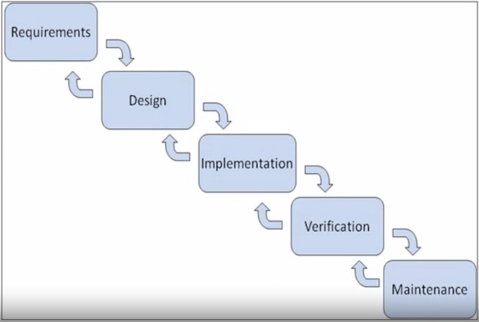
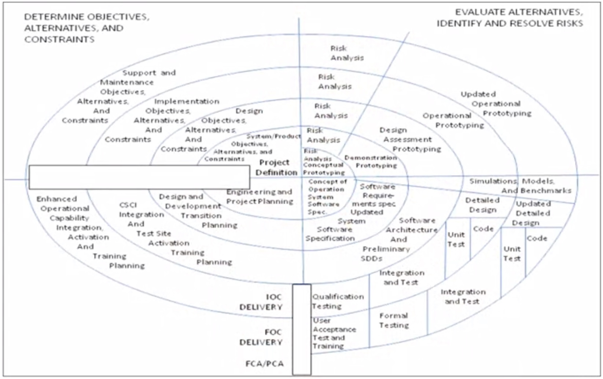
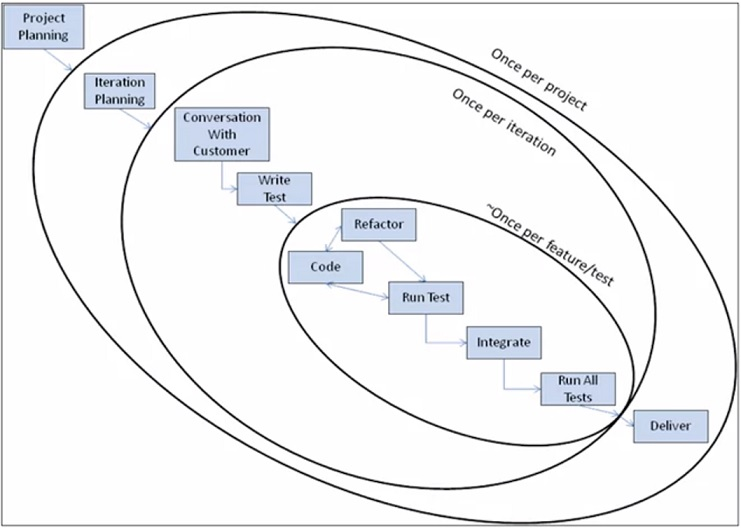
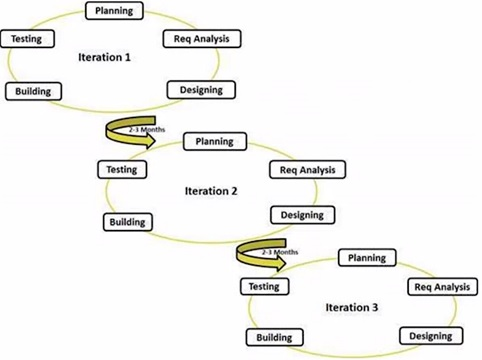
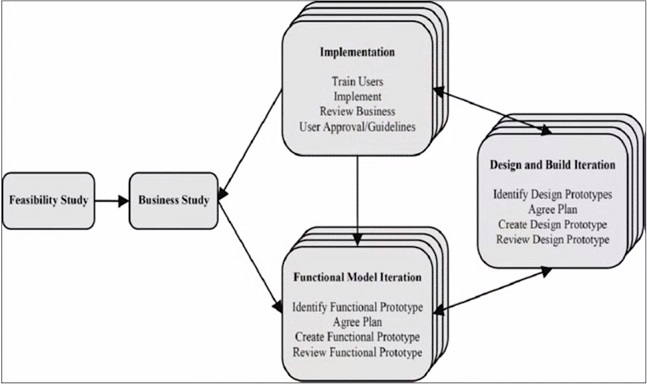
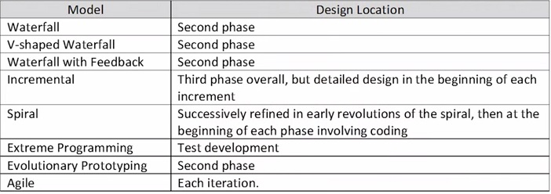
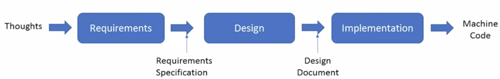
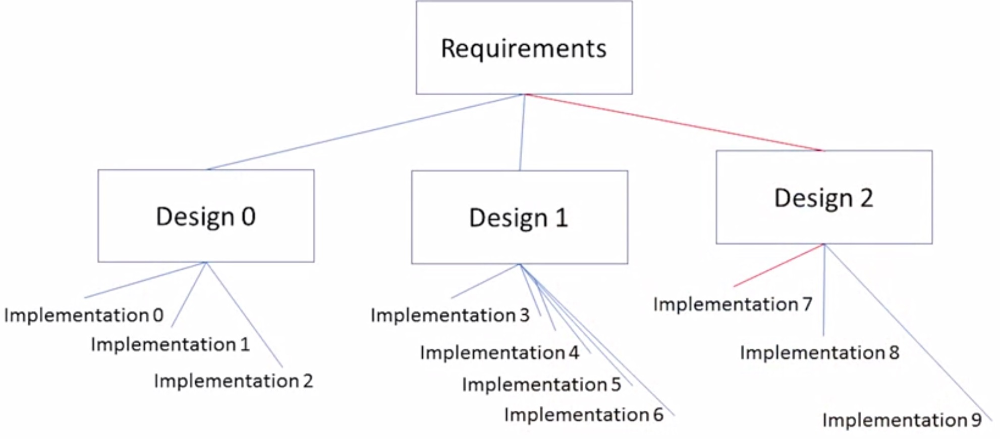
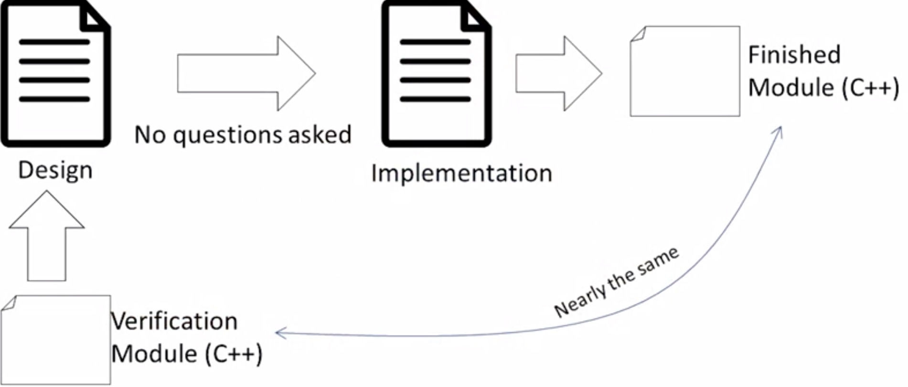
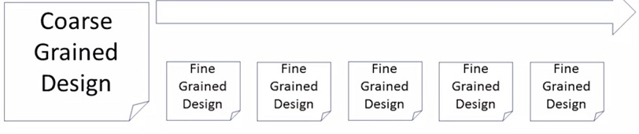

# [Secure Software Design Specialization](https://www.coursera.org/specializations/secure-software-design#courses)

## Course 1. [Software Design as an Element of the Software Development Lifecycle](https://www.coursera.org/learn/software-design-development-life-cycle/home/welcome)

### Week 1
#### [Thinking](https://www.coursera.org/learn/software-design-development-life-cycle/lecture/C34KA/thinking)
Лектор привел пример из своего опыта: он подготавливал речи для высокопоставленного офицера и в то время была наслуху концепция всеобщего качества ([TQM](https://ru.wikipedia.org/wiki/%D0%92%D1%81%D0%B5%D0%BE%D0%B1%D1%89%D0%B5%D0%B5_%D1%83%D0%BF%D1%80%D0%B0%D0%B2%D0%BB%D0%B5%D0%BD%D0%B8%D0%B5_%D0%BA%D0%B0%D1%87%D0%B5%D1%81%D1%82%D0%B2%D0%BE%D0%BC)), которую сформулировали на японских промышленных предприятиях. Одной из характерных черт этой концепции является пошагово описанные и регламентирванные процессы, выполнять которые могут любые подготовленные квалифицированные рабочие и на выходе будет одинаково качественный результат.

Лектора попросили подготовить похожее описание процесса написания речи. Очевидно, что процесс написания речи отличается от технологического процесса конкретного производства: в одном случае понадобится прибегнуть к библиотечным источникам, в другом позвонить в одну кампанию, в третьем - в другую; вопросы, которые будут ставится перед писателем каждый раз будут отличаться.

Далее декларируется тот факт, что невозможно придумать список поверки системы, выполнение которой гарантирует 100% защищенность этой системы. Создание устойчивых к атакам систем требует способности адаптироваться, требует умения думать.

### Week 2
#### [Software Development Life Cycle](https://www.coursera.org/learn/software-design-development-life-cycle/lecture/9uGpf/whats-an-sdlc)

- это множество стадий, через которые проект проходит на протяжении своей жизни.
> [additional resource about SDLC](https://www.tutorialspoint.com/sdlc/sdlc_overview.htm)

##### Waterfall (Каскадная модель)
1956, Herbert Benington, [Waterfall](https://en.wikipedia.org/wiki/Waterfall_model)

- под **Requirements** традионно понимают проблемы, которые требуется решить.
- **Design** первое приближение решения проблемы.
- **Implementation** стадия, на которой дизайн воплощается в коде инструкций, которые в состоянии выполнить компьютер.
- на стадии **Verification** запуски готовой программы используются для проверки корректности работы (решает ли программа поставленные проблемы).
- как только программа получена пользователями, скорректирована и адаптирована для запуска, наступает стадия **Maintenance**.

> [Стандарт ISO, описывающий процессы жизненного цикла программного обеспечения - построен на каскадной модели](https://ru.wikipedia.org/wiki/ISO/IEC_12207:2008)

Преимущества:
- последовательное выполнение этапов проекта в строгом фиксированном порядке
- позволяет оценивать качество продукта на каждом этапе

Недостатки:
- отсутствие обратных связей между этапами
- не соответствует реальным условиям разработки программного продукта

##### [V-Shape Waterfall (V-модель, разработка через тестиование)](https://en.wikipedia.org/wiki/V-Model_(software_development))

На каждой стадии V-модели происходит тестирование результата этой стадии. Является одной из основных практик экстремального программирования.

##### Waterfall with feedback (каскадная модель с обратной связью)

Эта модель допускает, что на каждой стадии возможен возврат к предыдущей и ее переделка с учетом вновь открытых обстоятельств.
> почему то лектор говорит (5:43), что "К сожалению, единственное появление фазы требований и отсутствие стрелок обратной связи к фазе требований означает, что требования должны быть правильными с первого раза." хотя стрелка к требованиям есть

##### [Spiral (спиральная модель)](https://ru.wikipedia.org/wiki/%D0%A1%D0%BF%D0%B8%D1%80%D0%B0%D0%BB%D1%8C%D0%BD%D0%B0%D1%8F_%D0%BC%D0%BE%D0%B4%D0%B5%D0%BB%D1%8C)

Каждый виток спирали соответствует созданию фрагмента или версии программного обеспечения, на нём уточняются цели и характеристики проекта, определяется его качество и планируются работы следующего витка спирали.

Каждый виток разбит на 4 сектора:
- определение целей
- оценка альтернатив, оценка и разрешение рисков
- разработка и тестирование
- планирование следующей итерации, доставка пользователю текущей версии

Недостатком здесь является то, что клиент и пользователи могут видеть на ранней стадии, какую форму принимает программное обеспечение.

Последующие фазы требований используют обратную связь с клиентами, и это приводит к продукту, более адаптированному к потребностям пользователей. Кроме того, это дает клиентам и пользователям больше времени, чтобы понять влияние программного обеспечения на их бизнес-процессы.

Таким образом, клиенты и пользователи не должны пытаться представить все требования сразу. Обучение, которое происходит от итерации к итерации, дает лучшие требования к качеству.

##### [XP (экстремальное программирование)](https://ru.wikipedia.org/wiki/%D0%AD%D0%BA%D1%81%D1%82%D1%80%D0%B5%D0%BC%D0%B0%D0%BB%D1%8C%D0%BD%D0%BE%D0%B5_%D0%BF%D1%80%D0%BE%D0%B3%D1%80%D0%B0%D0%BC%D0%BC%D0%B8%D1%80%D0%BE%D0%B2%D0%B0%D0%BD%D0%B8%D0%B5)

Основные приёмы XP (по первому изданию книги Extreme programming explained):

- короткий цикл обратной связи (Fine-scale feedback)
- разработка через тестирование (Test-driven development)
- игра в планирование (Planning game)
- заказчик всегда рядом (Whole team, Onsite customer): представитель заказчика ежедневно находится в команде
- парное программирование (Pair programming): один пишет "тактический код", который чинит тест; второй же смотрит боллее широко и может увидеть лучший путь решения проблемы
- непрерывный, а не пакетный процесс
- непрерывная интеграция (Continuous integration)
- рефакторинг (Design improvement, Refactoring)
- частые небольшие релизы (Small releases)
- понимание, разделяемое всеми
- простота проектирования (Simple design)
- метафора системы (архитектура)
- коллективное владение кодом (Collective code ownership) или выбранными шаблонами проектирования (Collective patterns ownership)
- стандарт оформления кода (Coding standard or Coding conventions)
- социальная защищённость программиста (Programmer welfare): 40-часовая рабочая неделя (Sustainable pace, Forty-hour week)

Требования к системе здесь не отсутсвуют: они должны быть выражены в терминах тестов.

**XP wisdom: feature without a test is not a feature**

##### [Agile (гибкая методология разработки)](https://ru.wikipedia.org/wiki/%D0%93%D0%B8%D0%B1%D0%BA%D0%B0%D1%8F_%D0%BC%D0%B5%D1%82%D0%BE%D0%B4%D0%BE%D0%BB%D0%BE%D0%B3%D0%B8%D1%8F_%D1%80%D0%B0%D0%B7%D1%80%D0%B0%D0%B1%D0%BE%D1%82%D0%BA%D0%B8)

- это итеративный процесс, в котором каждая итерация имеет общие характеристики, такие как анализ требований, проектирование и тестирование.

###### [Dynamic systems development method (метод разработки динамических систем)](https://ru.wikipedia.org/wiki/DSDM)

Относится к Agile семейству методологий.

Принципы:
- вовлечение пользователя - это основа ведения эффективного проекта, где разработчики делят с пользователями рабочее пространство и поэтому принимаемые решения будут более точными
- команда должна быть уполномочена принимать важные для проекта решения без согласования с начальством
- частая поставка версий результата, с учётом такого правила, что «поставить что-то хорошее раньше - это всегда лучше, чем поставить всё идеально сделанное в конце». Анализ поставок версий с предыдущей итерации учитывается на последующей
- главный критерий - как можно более быстрая поставка программного обеспечения, которое удовлетворяет текущим потребностям рынка. Но в то же время поставка продукта, который удовлетворяет потребностям рынка, менее важна, чем решение критических проблем в функционале продукта
- разработка - итеративная и инкрементальная. Она основывается на обратной связи с пользователем, чтобы достичь оптимального с экономической точки зрения решения
- любые изменения во время разработки - обратимы
- требования устанавливаются на высоком уровне прежде, чем начнётся проект
- тестирование интегрировано в жизненный цикл разработки
- взаимодействие и сотрудничество между всеми участниками необходимо для его эффективности

##### Таблица: момент определения требований к системе в описанных методологиях

##### Выводы
1. Дизайн системы представлен в каждой методологии управления жизненным циклом разработки ПО
2. В то время как жизненный цикл разработки ПО становится все более адаптивным, гибким, дизайн проектируется с возрастающей частотой

***
*Мои заметки*

Не очень понятно, почему лектор обсуждает Agile и XP на одном уровне. У меня всегда было примерно такое представление: Agile это класс (технологии разработки ПО), общая сущность, а XP же это инстанс этого класа.
***

#### [What happens in Design](https://www.coursera.org/learn/software-design-development-life-cycle/lecture/4mUqd/what-happens-in-design)

Можно взглянуть на требования, дизайн и реализацию как на серию трансформаций языка:
- **требования** описываются естественным язык (но желательно в терминах доменной области, который одназначно определены)

- **дизайн** описывается различными способами (в лекции приводится в пример UML, но я думаю, формальные методы тоже можно отнести сюда); дизайн показывает, как можно выполнить требования; хороший язык дизайна должна позволять проверять дизайн  - т.е. тот, кто знаком с данным языком, мог посмотреть на дизайн и понять, насколько дизайн соответствует требованиям и возможно или нет реализовать такой дизайн
> [Modeling languages](https://en.wikipedia.org/wiki/Modeling_language)

- **реализация** говорит на языке конкретных технологий и в конечном счете представляет собой машиннй код, написанный для конкретной программно-аппаратной архитектуры

Какой конкретно продукт получится на выходе фаз **дизайн** и **реализация** зависит от множества факторов (например, от того, кто решает задачу, какие инструменты использует и т.д.) - и это вносит неопределенность.

##### [Additional Resource](https://en.wikipedia.org/wiki/Software_design)

### Week 3

#### Design in different SDLCs

##### Дизайн на примере разработки по каскадной модели

Сначала группа людей на протяжении многих встреч разрабатывает требования, утверждает и подписывает их в виде **документа**. Затем требования используются для создания дизайна системы (часто теми же самыми людьми).

При этом неизбежно приходится уточнять и изменять исходные требования, что глава команды разработки принимает неохотно из за опасений критики со стороны пользователей системы.

Также зачастую дизайнеры игнорируют некоторые требования и делают так, как сам считают нужным (создаваться дизайны\архитектуры, которые были необходимы исходя из общей цели систем, но при этом они не основаны на каких либо формально зафиксированных требованиях).

Также в случае, если команда дизайнеров - это та же команда, что разрабатывала требования и та же команда что будет писать код, то часто она может делать довольно грубый дизайн потому, что:
- она составляли требования
- она знают точно для чего нужна система
- она могут исправить неточности дизайна кодом

Так случается потому, что в этом случае нет способа проверить соответствие дизайна требованиям.

Решением может быть нанять другую команду, которая изучит требования и дизайн и сможет проверить их соответсвие друг другу. Это довольно затратно.

Также другая команда не может так хорошо чувствовать требования\дизайн\реализацию как это чувствует так команда, которая уже несколько лет работает над ними - она будет сконцетрирована на поверхностных и очевидных несоответствиях.

В конечном счете, это приводит к тому, что никто не знает, хорош ли дизайн.

**Возникает вопрос: можно ли в принципе при работе в каскадной модели создать хороший дизайн?**
Ответ: да, но очень редко.

Для проверки дизайна есть способ: написать его упрощенный (в несущественных деталях) прототип. Тогда на стадию реализации возникнет минимальное количество вопросов.

##### Дизайн в Agile модели разработки
Agile основывается на частых поставках ценных фич командой разработки. Циклы итераций варьируется от нескольких недель до нескольких месяцев в зависимости от сложности проекта, размера команды и критичности разрабатываемой системы (каков потенциальный ущерб от неправильной работы системы).

В Agile есть шаг дизайна, но при этом он не фиксируется строго в документах (как это делается в каскадной модели).
В начале каждой итерации поставки ценной фич разрабатывается грубый, общий дизайн, который требует взгляда на цели системы в целом. Далее в процессе работы будут созданы дизайны небольших модулей кода.

