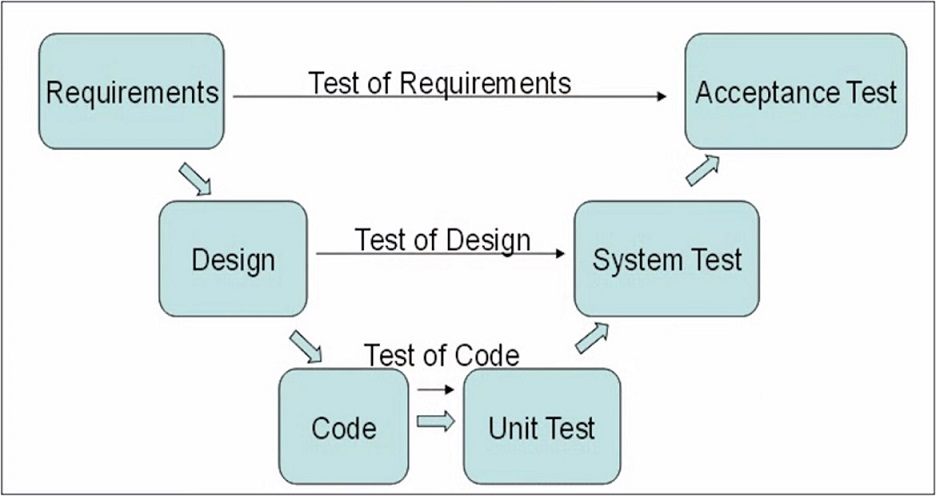

# [Secure Software Design Specialization](https://www.coursera.org/specializations/secure-software-design#courses)
<!-- TOC -->

- [Course 1. Software Design as an Element of the Software Development Lifecycle](#course-1-software-design-as-an-element-of-the-software-development-lifecycle)
    - [Week 1](#week-1)
        - [Thinking](#thinking)
    - [Week 2](#week-2)
        - [Software Development Life Cycle](#software-development-life-cycle)
            - [Waterfall (Каскадная модель)](#waterfall-%D0%BA%D0%B0%D1%81%D0%BA%D0%B0%D0%B4%D0%BD%D0%B0%D1%8F-%D0%BC%D0%BE%D0%B4%D0%B5%D0%BB%D1%8C)
            - [V-Shape Waterfall (V-модель, разработка через тестиование))](#v-shape-waterfall-v-%D0%BC%D0%BE%D0%B4%D0%B5%D0%BB%D1%8C-%D1%80%D0%B0%D0%B7%D1%80%D0%B0%D0%B1%D0%BE%D1%82%D0%BA%D0%B0-%D1%87%D0%B5%D1%80%D0%B5%D0%B7-%D1%82%D0%B5%D1%81%D1%82%D0%B8%D0%BE%D0%B2%D0%B0%D0%BD%D0%B8%D0%B5)
            - [Waterfall with feedback (каскадная модель с обратной связью)](#waterfall-with-feedback-%D0%BA%D0%B0%D1%81%D0%BA%D0%B0%D0%B4%D0%BD%D0%B0%D1%8F-%D0%BC%D0%BE%D0%B4%D0%B5%D0%BB%D1%8C-%D1%81-%D0%BE%D0%B1%D1%80%D0%B0%D1%82%D0%BD%D0%BE%D0%B9-%D1%81%D0%B2%D1%8F%D0%B7%D1%8C%D1%8E)
            - [Spiral (спиральная модель)](#spiral-%D1%81%D0%BF%D0%B8%D1%80%D0%B0%D0%BB%D1%8C%D0%BD%D0%B0%D1%8F-%D0%BC%D0%BE%D0%B4%D0%B5%D0%BB%D1%8C)
            - [XP (экстремальное программирование)](#xp-%D1%8D%D0%BA%D1%81%D1%82%D1%80%D0%B5%D0%BC%D0%B0%D0%BB%D1%8C%D0%BD%D0%BE%D0%B5-%D0%BF%D1%80%D0%BE%D0%B3%D1%80%D0%B0%D0%BC%D0%BC%D0%B8%D1%80%D0%BE%D0%B2%D0%B0%D0%BD%D0%B8%D0%B5)
            - [Agile (гибкая методология разработки)](#agile-%D0%B3%D0%B8%D0%B1%D0%BA%D0%B0%D1%8F-%D0%BC%D0%B5%D1%82%D0%BE%D0%B4%D0%BE%D0%BB%D0%BE%D0%B3%D0%B8%D1%8F-%D1%80%D0%B0%D0%B7%D1%80%D0%B0%D0%B1%D0%BE%D1%82%D0%BA%D0%B8)
                - [Dynamic systems development method (метод разработки динамических систем)](#dynamic-systems-development-method-%D0%BC%D0%B5%D1%82%D0%BE%D0%B4-%D1%80%D0%B0%D0%B7%D1%80%D0%B0%D0%B1%D0%BE%D1%82%D0%BA%D0%B8-%D0%B4%D0%B8%D0%BD%D0%B0%D0%BC%D0%B8%D1%87%D0%B5%D1%81%D0%BA%D0%B8%D1%85-%D1%81%D0%B8%D1%81%D1%82%D0%B5%D0%BC)
            - [Таблица: момент определения требований к системе в описанных методологиях](#%D1%82%D0%B0%D0%B1%D0%BB%D0%B8%D1%86%D0%B0-%D0%BC%D0%BE%D0%BC%D0%B5%D0%BD%D1%82-%D0%BE%D0%BF%D1%80%D0%B5%D0%B4%D0%B5%D0%BB%D0%B5%D0%BD%D0%B8%D1%8F-%D1%82%D1%80%D0%B5%D0%B1%D0%BE%D0%B2%D0%B0%D0%BD%D0%B8%D0%B9-%D0%BA-%D1%81%D0%B8%D1%81%D1%82%D0%B5%D0%BC%D0%B5-%D0%B2-%D0%BE%D0%BF%D0%B8%D1%81%D0%B0%D0%BD%D0%BD%D1%8B%D1%85-%D0%BC%D0%B5%D1%82%D0%BE%D0%B4%D0%BE%D0%BB%D0%BE%D0%B3%D0%B8%D1%8F%D1%85)
            - [Выводы](#%D0%B2%D1%8B%D0%B2%D0%BE%D0%B4%D1%8B)
        - [What happens in Design](#what-happens-in-design)
            - [Additional Resource](#additional-resource)
    - [Week 3](#week-3)
        - [Design in different SDLCs](#design-in-different-sdlcs)
            - [Дизайн на примере разработки по каскадной модели](#%D0%B4%D0%B8%D0%B7%D0%B0%D0%B9%D0%BD-%D0%BD%D0%B0-%D0%BF%D1%80%D0%B8%D0%BC%D0%B5%D1%80%D0%B5-%D1%80%D0%B0%D0%B7%D1%80%D0%B0%D0%B1%D0%BE%D1%82%D0%BA%D0%B8-%D0%BF%D0%BE-%D0%BA%D0%B0%D1%81%D0%BA%D0%B0%D0%B4%D0%BD%D0%BE%D0%B9-%D0%BC%D0%BE%D0%B4%D0%B5%D0%BB%D0%B8)
            - [Дизайн в Agile модели разработки](#%D0%B4%D0%B8%D0%B7%D0%B0%D0%B9%D0%BD-%D0%B2-agile-%D0%BC%D0%BE%D0%B4%D0%B5%D0%BB%D0%B8-%D1%80%D0%B0%D0%B7%D1%80%D0%B0%D0%B1%D0%BE%D1%82%D0%BA%D0%B8)
            - [Additional Resource](#additional-resource)
        - [Interfacing with requirements and implementation](#interfacing-with-requirements-and-implementation)
            - [Additional Resource](#additional-resource)
    - [Week 4](#week-4)
        - [The role of architecture in design](#the-role-of-architecture-in-design)
            - [Additional Resource](#additional-resource)
        - [Permitted activities that can cause problems](#permitted-activities-that-can-cause-problems)

<!-- /TOC -->

## Course 1. [Software Design as an Element of the Software Development Lifecycle](https://www.coursera.org/learn/software-design-development-life-cycle/home/welcome)

### Week 1

#### [Thinking](https://www.coursera.org/learn/software-design-development-life-cycle/lecture/C34KA/thinking)
Лектор привел пример из своего опыта: он подготавливал речи для высокопоставленного офицера и в то время была наслуху концепция всеобщего качества ([TQM](https://ru.wikipedia.org/wiki/%D0%92%D1%81%D0%B5%D0%BE%D0%B1%D1%89%D0%B5%D0%B5_%D1%83%D0%BF%D1%80%D0%B0%D0%B2%D0%BB%D0%B5%D0%BD%D0%B8%D0%B5_%D0%BA%D0%B0%D1%87%D0%B5%D1%81%D1%82%D0%B2%D0%BE%D0%BC)), которую сформулировали на японских промышленных предприятиях. Одной из характерных черт этой концепции является пошагово описанные и регламентирванные процессы, выполнять которые могут любые подготовленные квалифицированные рабочие и на выходе будет одинаково качественный результат.

Лектора попросили подготовить похожее описание процесса написания речи. Очевидно, что процесс написания речи отличается от технологического процесса конкретного производства: в одном случае понадобится прибегнуть к библиотечным источникам, в другом позвонить в одну кампанию, в третьем - в другую; вопросы, которые будут ставится перед писателем каждый раз будут отличаться.

Далее декларируется тот факт, что невозможно придумать список поверки системы, выполнение которой гарантирует 100% защищенность этой системы. Создание устойчивых к атакам систем требует способности адаптироваться, требует умения думать.

### Week 2

#### [Software Development Life Cycle](https://www.coursera.org/learn/software-design-development-life-cycle/lecture/9uGpf/whats-an-sdlc)

- это множество стадий, через которые проект проходит на протяжении своей жизни.
> [additional resource about SDLC](https://www.tutorialspoint.com/sdlc/sdlc_overview.htm)

##### Waterfall (Каскадная модель)
1956, Herbert Benington, [Waterfall](https://en.wikipedia.org/wiki/Waterfall_model)


- под **Requirements** традионно понимают проблемы, которые требуется решить.
- **Design** первое приближение решения проблемы.
- **Implementation** стадия, на которой дизайн воплощается в коде инструкций, которые в состоянии выполнить компьютер.
- на стадии **Verification** запуски готовой программы используются для проверки корректности работы (решает ли программа поставленные проблемы).
- как только программа получена пользователями, скорректирована и адаптирована для запуска, наступает стадия **Maintenance**.

> [Стандарт ISO, описывающий процессы жизненного цикла программного обеспечения - построен на каскадной модели](https://ru.wikipedia.org/wiki/ISO/IEC_12207:2008)

Преимущества:
- последовательное выполнение этапов проекта в строгом фиксированном порядке
- позволяет оценивать качество продукта на каждом этапе

Недостатки:
- отсутствие обратных связей между этапами
- не соответствует реальным условиям разработки программного продукта

##### [V-Shape Waterfall (V-модель, разработка через тестиование)](https://en.wikipedia.org/wiki/V-Model_(software_development))


На каждой стадии V-модели происходит тестирование результата этой стадии. Является одной из основных практик экстремального программирования.

##### Waterfall with feedback (каскадная модель с обратной связью)


Эта модель допускает, что на каждой стадии возможен возврат к предыдущей и ее переделка с учетом вновь открытых обстоятельств.
> почему то лектор говорит (5:43), что "К сожалению, единственное появление фазы требований и отсутствие стрелок обратной связи к фазе требований означает, что требования должны быть правильными с первого раза." хотя стрелка к требованиям есть


##### [Spiral (спиральная модель)](https://ru.wikipedia.org/wiki/%D0%A1%D0%BF%D0%B8%D1%80%D0%B0%D0%BB%D1%8C%D0%BD%D0%B0%D1%8F_%D0%BC%D0%BE%D0%B4%D0%B5%D0%BB%D1%8C)


Каждый виток спирали соответствует созданию фрагмента или версии программного обеспечения, на нём уточняются цели и характеристики проекта, определяется его качество и планируются работы следующего витка спирали.

Каждый виток разбит на 4 сектора:
- определение целей
- оценка альтернатив, оценка и разрешение рисков
- разработка и тестирование
- планирование следующей итерации, доставка пользователю текущей версии

Недостатком здесь является то, что клиент и пользователи могут видеть на ранней стадии, какую форму принимает программное обеспечение.

Последующие фазы требований используют обратную связь с клиентами, и это приводит к продукту, более адаптированному к потребностям пользователей. Кроме того, это дает клиентам и пользователям больше времени, чтобы понять влияние программного обеспечения на их бизнес-процессы.

Таким образом, клиенты и пользователи не должны пытаться представить все требования сразу. Обучение, которое происходит от итерации к итерации, дает лучшие требования к качеству.

##### [XP (экстремальное программирование)](https://ru.wikipedia.org/wiki/%D0%AD%D0%BA%D1%81%D1%82%D1%80%D0%B5%D0%BC%D0%B0%D0%BB%D1%8C%D0%BD%D0%BE%D0%B5_%D0%BF%D1%80%D0%BE%D0%B3%D1%80%D0%B0%D0%BC%D0%BC%D0%B8%D1%80%D0%BE%D0%B2%D0%B0%D0%BD%D0%B8%D0%B5)


Основные приёмы XP (по первому изданию книги Extreme programming explained):

- короткий цикл обратной связи (Fine-scale feedback)
- разработка через тестирование (Test-driven development)
- игра в планирование (Planning game)
- заказчик всегда рядом (Whole team, Onsite customer): представитель заказчика ежедневно находится в команде
- парное программирование (Pair programming): один пишет "тактический код", который чинит тест; второй же смотрит боллее широко и может увидеть лучший путь решения проблемы
- непрерывный, а не пакетный процесс
- непрерывная интеграция (Continuous integration)
- рефакторинг (Design improvement, Refactoring)
- частые небольшие релизы (Small releases)
- понимание, разделяемое всеми
- простота проектирования (Simple design)
- метафора системы (архитектура)
- коллективное владение кодом (Collective code ownership) или выбранными шаблонами проектирования (Collective patterns ownership)
- стандарт оформления кода (Coding standard or Coding conventions)
- социальная защищённость программиста (Programmer welfare): 40-часовая рабочая неделя (Sustainable pace, Forty-hour week)

Требования к системе здесь не отсутсвуют: они должны быть выражены в терминах тестов.

**XP wisdom: feature without a test is not a feature**

##### [Agile (гибкая методология разработки)](https://ru.wikipedia.org/wiki/%D0%93%D0%B8%D0%B1%D0%BA%D0%B0%D1%8F_%D0%BC%D0%B5%D1%82%D0%BE%D0%B4%D0%BE%D0%BB%D0%BE%D0%B3%D0%B8%D1%8F_%D1%80%D0%B0%D0%B7%D1%80%D0%B0%D0%B1%D0%BE%D1%82%D0%BA%D0%B8)

- это итеративный процесс, в котором каждая итерация имеет общие характеристики, такие как анализ требований, проектирование и тестирование.


###### [Dynamic systems development method (метод разработки динамических систем)](https://ru.wikipedia.org/wiki/DSDM)

Относится к Agile семейству методологий.


Принципы:
- вовлечение пользователя - это основа ведения эффективного проекта, где разработчики делят с пользователями рабочее пространство и поэтому принимаемые решения будут более точными
- команда должна быть уполномочена принимать важные для проекта решения без согласования с начальством
- частая поставка версий результата, с учётом такого правила, что «поставить что-то хорошее раньше - это всегда лучше, чем поставить всё идеально сделанное в конце». Анализ поставок версий с предыдущей итерации учитывается на последующей
- главный критерий - как можно более быстрая поставка программного обеспечения, которое удовлетворяет текущим потребностям рынка. Но в то же время поставка продукта, который удовлетворяет потребностям рынка, менее важна, чем решение критических проблем в функционале продукта
- разработка - итеративная и инкрементальная. Она основывается на обратной связи с пользователем, чтобы достичь оптимального с экономической точки зрения решения
- любые изменения во время разработки - обратимы
- требования устанавливаются на высоком уровне прежде, чем начнётся проект
- тестирование интегрировано в жизненный цикл разработки
- взаимодействие и сотрудничество между всеми участниками необходимо для его эффективности

##### Таблица: момент определения требований к системе в описанных методологиях


##### Выводы
1. Дизайн системы представлен в каждой методологии управления жизненным циклом разработки ПО
2. В то время как жизненный цикл разработки ПО становится все более адаптивным, гибким, дизайн проектируется с возрастающей частотой

***
*Мои заметки*

- Не очень понятно, почему лектор обсуждает Agile и XP на одном уровне. У меня всегда было примерно такое представление: Agile это класс (технологии разработки ПО), общая сущность, а XP же это инстанс этого класа.

- не упомянута интересная [методология чистой комнаты](https://ru.wikipedia.org/wiki/Cleanroom_Software_Engineering)
Как раз она может поспорить с утверждением лектора о том, что невозможно создать чек лист, который гарантирует безопасность и надежность системы


***

#### [What happens in Design](https://www.coursera.org/learn/software-design-development-life-cycle/lecture/4mUqd/what-happens-in-design)


Можно взглянуть на требования, дизайн и реализацию как на серию трансформаций языка:
- **требования** описываются естественным языком (но желательно в терминах доменной области, которые одназначно определены)

- **дизайн** описывается различными способами (в лекции приводится в пример UML, но я думаю, формальные методы тоже можно отнести сюда); дизайн показывает, как можно выполнить требования; хороший язык дизайна должна позволять проверять дизайн  - т.е. тот, кто знаком с данным языком, мог посмотреть на дизайн и понять, насколько дизайн соответствует требованиям и возможно или нет реализовать такой дизайн
> [Modeling languages](https://en.wikipedia.org/wiki/Modeling_language)

- **реализация** говорит на языке конкретных технологий и в конечном счете представляет собой машиннй код, написанный для конкретной программно-аппаратной архитектуры

Какой конкретно продукт получится на выходе фаз **дизайн** и **реализация** зависит от множества факторов (например, от того, кто решает задачу, какие инструменты использует и т.д.) - и это вносит неопределенность.


##### [Additional Resource](https://en.wikipedia.org/wiki/Software_design)

### Week 3

#### Design in different SDLCs

##### Дизайн на примере разработки по каскадной модели

Сначала группа людей на протяжении многих встреч разрабатывает требования, утверждает и подписывает их в виде **документа**. Затем требования используются для создания дизайна системы (часто теми же самыми людьми).

При этом неизбежно приходится уточнять и изменять исходные требования, что глава команды разработки принимает неохотно из-за опасений критики со стороны пользователей системы.

Также зачастую дизайнеры игнорируют некоторые требования и делают так, как сами считают нужным (создают дизайны\архитектуры, которые были необходимы исходя из общей цели систем, но при этом они не основаны на каких либо формально зафиксированных требованиях).

Также в случае, если команда дизайнеров - это та же команда, что разрабатывала требования и та же команда что будет писать код, то часто она может делать довольно грубый дизайн потому, что:
- она составляла требования
- она знает точно для чего нужна система
- она может исправить неточности дизайна кодом

Так случается потому, что в этом случае нет способа проверить соответствие дизайна требованиям.

Решением может быть нанять другую команду, которая изучит требования и дизайн и сможет проверить их соответсвие друг другу. Это довольно затратно.

Также другая команда не может так хорошо чувствовать требования\дизайн\реализацию как это чувствует так команда, которая уже несколько лет работает над ними - она будет сконцетрирована на поверхностных и очевидных несоответствиях.

В конечном счете, это приводит к тому, что никто не знает, хорош ли дизайн.

**Возникает вопрос: можно ли в принципе при работе в каскадной модели создать хороший дизайн?**
Ответ: да, но очень редко.

Для проверки дизайна есть способ: написать его упрощенный (в несущественных деталях) прототип. Тогда на стадии реализации возникнет минимальное количество вопросов.


##### Дизайн в Agile модели разработки
Agile основывается на частых поставках ценных фич командой разработки. Циклы итераций варьируются от нескольких недель до нескольких месяцев в зависимости от сложности проекта, размера команды и критичности разрабатываемой системы (каков потенциальный ущерб от неправильной работы системы).

В Agile есть шаг дизайна, но при этом он не фиксируется строго в документах (как это делается в каскадной модели).
В начале каждой итерации поставки ценной фичи разрабатывается грубый, общий дизайн, который требует взгляда на цели системы в целом. Далее в процессе работы будут созданы дизайны небольших модулей кода.


##### [Additional Resource](http://wiki.c2.com/?WhatIsSoftwareDesign)
Проводится параллель между проектированием и изготовлением инженерных систем\деталей машин\изделий и созданием программного обеспечения.

Рассматривается следующий посыл: инженерному проекту соответсвует листинг исходного кода (не UML диаграмма или любое другое высокоуровневое представление проекта системы (дизайна)), а сборочной линии соответствует компилятор. Проект - исходный код, а "сборочная линия на заводе" - это компилятор.
Программное обеспечение - это не исходный код, это последовательность нулей и единиц, которая запускается на компьютерах.

Далее критикуется набор статей\высказываний конкретно об этом посыле и о разработке ПО в целом.
По мнению автора, шагу поддержки ПО во всех существующих методологиях разработки (кроме XP) уделяется недостаточно внимания.

Главная мысль автора статьи: в разработке ПО достаточно сложно выделить "дизайн" и "конечный продукт", скорее это множество точек на пути к конечному продукту и одна и та же точка может быть как продуктом предудущей стадии, так и дизайном следующей <. . . . .>.
"Дизайн" и "продукт" не зафиксированные во Вселенной точки, а движение, в котором мы надеемся что очередное изменение принесет больше пользы, чем вреда.

#### Interfacing with requirements and implementation

В общем можно сказать, что дизайн преобразует требования в понятную для реализации форму.
Первый вопрос, который появляется при разработке дизайна системы: как передать все необходимые знания, которые есть у того, кто разработал требования, тому, кто разрабатывает дизайн (не всегда это одно и то же лицо).
Часто требования нуждаются в переформулировании, например, когда это просто набор запросов разных ответственных людей.

**Для того, чтобы начать разрабатывать дизайн, необходимо иметь целостную картину системы, понимать, как одни ее части зависят от других.**
Например, можно начать со следующего:
- разделить мысленно систему по тем частям, функционал которых тесно связан (думаю, доменная модель здесь кстати)
> лектор называет это fault lines


- оценить риски проекта
> это зависит уже от личного опыта: если ты хорошо разбираешься в БД, то часть системы, связанная с БД вряд ли несет большие риски


После того, как это сделано, логичным следующим шагом будет смягчение рисков: узать больше о конкретном риске.
Следующий шаг - создание прототипа системы\ее части.


##### Additional Resource
1. [Requirements Versus Design: It’s All Design](http://www.its-all-design.com/requirements-versus-design-its-all-design/)
> пост, в котором требования рассмотриваются неотделимыми от дизайна: как только ты, как разработчик\аналитик, начинаешь задавать уточняющие вопросы заказчику о деталях работы системы, ты начинаешь создавать дизайн, а не просто записываешь список под диктовку заказчика
2. [The Web Design Process](https://www.lifewire.com/web-design-process-3466386)
> короткий пост о этапах проектирования веб сайта

### Week 4

#### The role of architecture in design

В некоторых случаях дизайн системы разбивают на высокоуровневый и низкоуровневый (например, в Agile-цикле разработки, где вначале всей разработки создается всеобъемлющий общий дизайн, а в начале каждой итерации проектируется кусочек системы, который будет реализован в этой итерации):


Этот низкоуровневый дизайн обычно понимается как дизайн, а высокоуровневый - как архитектура.

Далее лектор иллюстрирует на примерах из личного опыта, что безопасть системы в большей мере зависит от принятых архитектурных решений, чем от низкоуровневого дизайна.


##### Additional Resource
[Software Architecture (общий набросок для микроконтроллерных систем)](http://www.the-software-experts.com/e_dta-sw-design-high-level.php)


#### Permitted activities that can cause problems

Лектор приводит пример: однажды один человек случайно отправил email на всю компанию, другие люди стали ему отвечать (также на всю компанию), как итог email система была серьезно нагружена.

Это пример разрешенной (для пользователя) активности в системе, которая, тем не менее, может привести к серьезным проблемам.

Еще один пример из разработки ПО: если следовать принципу модульности, код, отвечающий за одну задачу (использовать который возможно требуется в разных местах), лежит только в одном месте. При этом, если в этом месте он сломан - сломается весь код, который его использует.
> [Open SSL бага Heartbleed отлично демонистрирует такой вариант](https://ru.wikipedia.org/wiki/Heartbleed)

Главая идея, которую старается донести лектор (также, как и в первых лекциях): невозможно составить чек лист, следуя которому, получишь защищенную от атак или проблем, подобных описанному примеру с рассылкой, систему - необходимо думать, кем и как система будет использоваться и как это может нанести вред.
Такой чек лист может иметь только вид:
- подумай хорошо (кто может эксплуатировать определенное поведение системы)
- подумай еще раз

Очевидно, что наличии еще одного человека (помимо дизайнера\архитектора системы), который может проверить систему, весьма полезно.

Примеры, использование которых надо проанализировать с точки зрения безопасности:
1. drug'n'drop произвольного текстового файла в разрабатываемое приложение: сможет ли приложение корректно распарсить его и не представляет ли угрозу специально подготовленный файл
2. разработка сетевого адаптера: сможет ли он корректно обработать некорректные пакеты, подготовленные злоумышленником
3. некоторый веб скрапер: страницы представляют собой просто гипер текст (здесь угроза аналогично первому примеру)
4. архивация\распаковка файла: архивация не несет существенных угроз, тогда как распаковка - да, может быть опасна, ведь архив может быть поврежден (намеряно или нет)
5. бинарный блоб в БД: хранение безопасно, обработка - нет

> забавно, что вопросы про это были в тесте за предыдущую неделю

Идемпотентная транзакция:
```
DELETE FROM USER WHERE USERID = 12345
````

Неидемпотентная транзакция:
```
DELETE FROM USER WHERE USERID = (SELECT MAX(USERID) FROM USER)
```